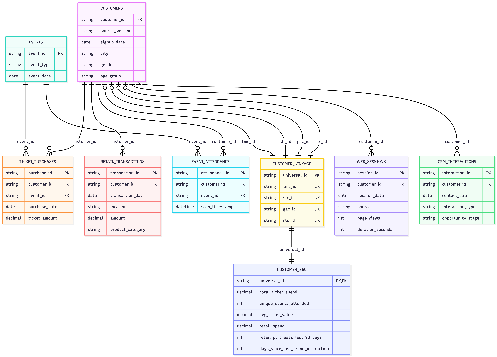

# compass-analytics-interview

<i>
You are building a customer 360º model for a sports and entertainment company to support the various business units in their decision making and tactical efforts. The data engineering team has already ingested various data sources into the bronze and silver layers and has made their data tables available for you to build their data model.

 

The primary objective is to build a customer 360 data model that can support various customer analytics use cases from: customer lifetime value, customer segmentation, customer churn, customer targeting & retention, prospective premium customers, willingness to pay, etc.
</i>

> **360 Degree Models**  
> Data modeling strategy that integrates every available data point about a specific entity into a single, unified view. In the context of this case, the entity in question is a customer

## Datasets
| SOURCE SYSTEM | DATASET |
|---------------|---------|
| Ticketmaster | - `ticket_purchases.csv`: Online ticket purchases per event   - `event_attendance.csv`: Attendance scan-ins by customers   - `events.csv`: Metadata for each event |
| Salesforce CRM | - `crm_interactions.csv`: Contact history and opportunity stages |
| Google Analytics | - `web_sessions.csv`: Website sessions including source, duration, and engagement |
| Retail POS | - `retail_transactions.csv`: In-venue or merchandise store purchases |
| Customer Profiles | - `customer.csv`: Partial demographic and signup metadata across systems |
| Customer Linkage | - `customer_linkage.csv`: A mapping table linking system-specific customer IDs to a shared universal_id |

## EDA Insights

### Takeaways
## Takeaways
- Customer identifiers are source-system specific (`tmc_`, `sfc_`, `gac_`, `rtc_`), so direct joins on `customer_id` across systems are invalid
- The provided `customer_linkage` table is useful for Task 2, but its coverage is limited relative to the raw source populations
- Date fields across the datasets need to be standardized to datetime before any recency-based features are calculated
- For Task 2, unresolved source-system customers should still be preserved where possible as single-system records rather than dropped

### Strategy

- **Fallback strategy needed** for source IDs not in the linkage table: either create single-system records or accept data loss.
- **"Last 90 days"** and **"days since last interaction"** features depend on a clear reference date. Check whether to use `max(all dates)` or today's date.
- **Cross-system joins** must go through the linkage table; never compare `tmc_*` IDs directly to `sfc_*` IDs.

## Task #1: Identify Resolution Strategy
<i>
The linking table was developed by a previous internal employee and may have errors thus the client has hired us to provide a new identity resolution strategy to unify the source systems. Your task is to describe (in a diagram, slide and/or pseudocode) how you would approach doing identity resolution across their many systems based on your expertise. Note that a linkage table is provided in the datasets .zip will be used for task #2 while your goal here is to design and not to implement.
</i>

 

> **Assumptions**
> - Some customers have not made a user profile, so we will have to use other methods to match customer profiles with their activities
> - We have access to all of the provided datasets, both external and internal

### Proposed ERD

### Proposed Identity Resolution Strategy

For this case study, identity resolution uses the provided customer_linkage table as the bridge between source-specific customer IDs and a shared universal_id. Each source record is first mapped to its corresponding universal_id, and records not found in the linkage table are preserved as deterministic single-system customers instead of being dropped. This allows the Customer 360 build to retain maximum coverage while still supporting cross-system aggregation where linkage exists.

This is a practical, linkage-driven approach aligned to the available data and the gold table notebook implementation. In production, this would likely be extended with stronger matching and validation logic, but for this task the linkage table is used as the trusted resolution layer for feature generation and final customer_360 assembly.

<!--
Ideas:
- Explore using K-Means clustering for unidentified customer profiles
- Focus should be on the practicalities of the implementation, we can abstract some of the technical details of matching unidentified customer profiles with their activities
-->

## Task #2: Build the Customer 360 Gold Table
<i>
Using the datasets provided, as well as the linkage table, design and implement a consolidated customer_360 table. The table should also include the following features (or as many as are feasible). Implement this in a Jupyter Notebook (or an equivalent platform).

 

- Total ticket spend (lifetime)
- Number of unique events attended
- Average ticket value
- Total merchandise/retail spend
- Number of retail purchases in the last 90 days
- Days since last brand interaction (via any channel: ticket, web, retail, or CRM)
</i>

 

> **Assumptions**
> - We should use the linkage table as a part of our solution even though there are potential problems with it, as outlined in task #1 and in the EDA step

## Task #3: Data Platform Overview
<i>
The client’s systems are based on legacy RDBMS data mart with pipelines stitched together with cron jobs running on virtual machine (VMs) while data governance is non-existent except for tribal knowledge accumulated within the IT team. Your task is to propose (as a diagram or a slide) a high-level data platform architecture to host the pipelines integrating source data to a centralized repository, and which is cloud-native, scalable, and can do both Data & ML. You may combine multiple platforms and tools as long as you can explain what and why to the client.
</i>

 

> **Assumptions**
> - TODO

<!--
Ideas:
- Provide different options for the data platform using different platforms (i.e. AWS, Azure, Google Cloud, Databricks, Dataiku, Snowflake). Base the suggestions on specific situations
- Identify specific ways to pull from different data sources. Create a new slide for each of the data sources
- Identify which flows need to be migrated and how they should be migrated
-->

## Project Extensions

> **Assumptions**
> - **Canadian Law**: The project is for a Canadian business. Thus, we only have to worry about Canadian regulation

### Data Governance
<!-- Consider performing governance training on best practices for the data platform -->
TODO

### IT & Business Continuity
<!-- Establish a plan to maintain the data pipeline and migration knowledge and keep teams un-siloed -->
TODO

### Regulatory Compliance
<!-- Consider any regulatory issues with the data -->
TODO

### Future State
<!-- Recommend future state changes to make the data pipeline better and suggest potential upgrades to the system. Include additional external data sources and how they should be pulled -->
TODO